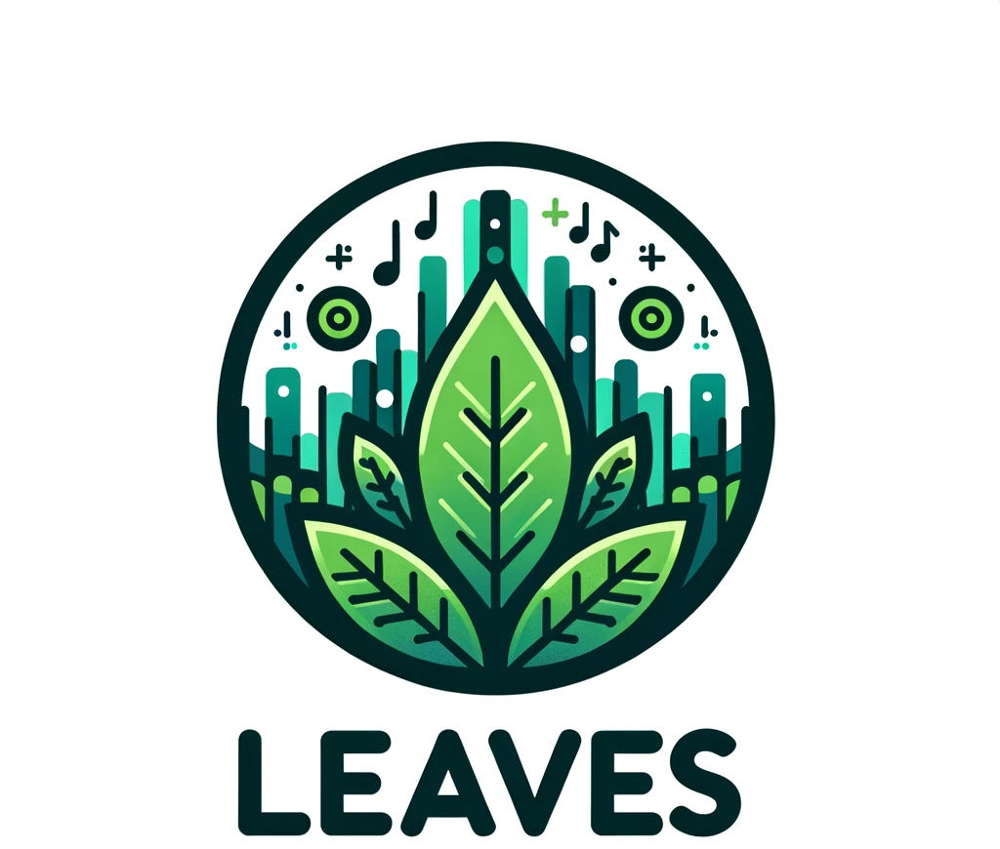
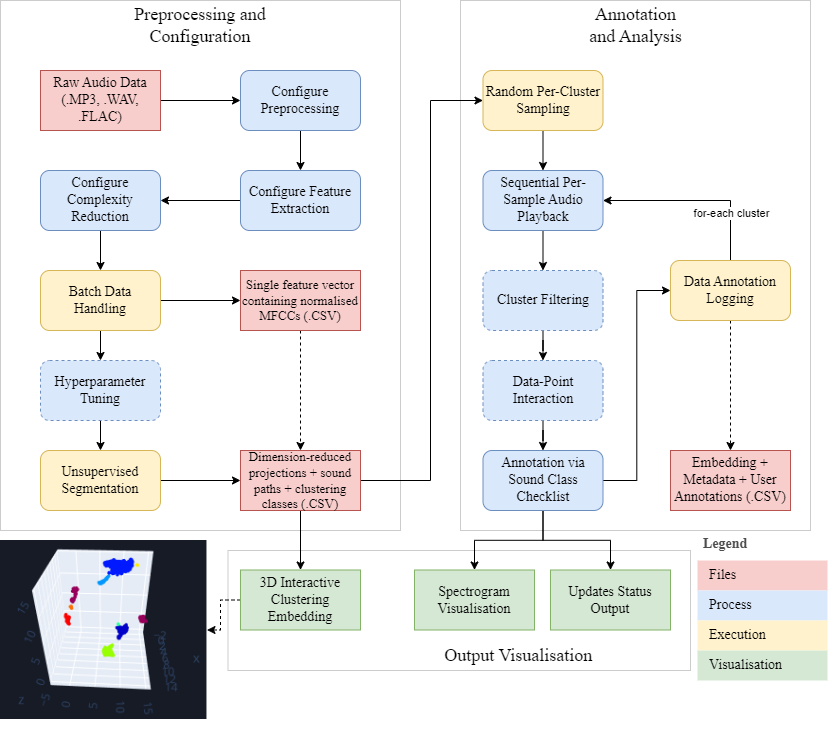

<p align="center"></p>

# LEAVES: Large-scale Ecoacoustics Annotation and Visualisation with Efficient Segmentation


[](https://opensource.org/licenses/MIT)

---

## ➤ Overview
LEAVES is a powerful ecoacoustics tool designed to streamline the annotation and visualization of large-scale natural soundscape datasets. By leveraging advanced machine learning, real-time analysis, and a user-friendly interface, LEAVES empowers researchers and citizen scientists to process and label their data efficiently.

<p align="center"></p>

---

## ➤ Key Features
- **Efficient Labeling:** Reduces annotation time for large datasets with cluster-based workflows.
- **Interactive Visualizations:** Explore your data in 3D scatterplots, spectrograms, and waveforms.
- **Customizable Configuration:** Flexible settings for preprocessing, clustering, and visualization.
- **Multi-Format Support:** Works with `.WAV`, `.MP3`, `.FLAC`, and more.
- **Real-Time Spectrograms:** Analyze acoustic features while annotating.
- **Cluster Filtering:** Focus on specific sound groups for detailed examination.

<p align="center">
     
    
</p>

---

## ➤ User Guide
Get the most out of LEAVES with the [**LEAVES User Guide**](https://thomasnapier.github.io/LEAVES/user_guide.html), which includes:
- Step-by-step setup instructions.
- Detailed explanations of features like **File Uploading**, **Annotation**, **Cluster Filtering**, and more.
- Visual examples and troubleshooting tips.

---

## ➤ Getting Started
Follow these steps to install and start using LEAVES:

### 1. Clone the Repository
```bash
git clone https://github.com/thomasnapier/LEAVES.git
```

### 2. Install Dependencies
Navigate to the project directory and install the required Python libraries:
```bash
pip install -r requirements.txt
```

### 3. Run the Application
Start the web-based interface by running:
```bash
python app.py
```
Open your browser and navigate to `http://127.0.0.1:8050`.

### 4. Upload Your Data
Use the **Upload Module** to import your audio recordings and visualize them in 3D scatterplots.

### 5. Annotate and Save
Process, annotate, and save your data using LEAVES' advanced clustering and annotation tools.

---

## ➤ How LEAVES Works

1. **Data Ingestion:** Upload audio recordings in `.WAV`, `.MP3`, `.FLAC`, or other supported formats.
2. **Signal Processing:** Denoising, short-term windowing, and feature extraction (e.g., MFCCs) prepare your data for analysis.
3. **Dimensionality Reduction:** Techniques like **UMAP** and **t-SNE** reduce data complexity for intuitive visualization.
4. **Clustering:** Algorithms like **DBSCAN** and **k-means** group similar sounds for efficient labeling.
5. **Annotation:** Assign labels to clusters or individual points, with propagation features to save time.
6. **Visualization:** Interactive tools like waveforms, spectrograms, and 3D scatterplots aid exploration and analysis.

---

## ➤ Notes
- **Technologies Used:** Python 3, Dash, Plotly, Librosa, Scikit-Learn.
- **Current Status:** Alpha Version.
- **Demo Instance:** [Try the Demo](https://leaves-xuli.onrender.com/)
- **Documentation:** [User Guide](https://thomasnapier.github.io/LEAVES/user_guide.html)

---

## ➤ Useful Links
- [Project Site](https://thomasnapier.github.io/LEAVES/): Comprehensive guide and instructions for LEAVES features.
- [Installation Guide](https://thomasnapier.github.io/LEAVES/user_guide.html#download): Detailed instructions for setup.
- [Demo Instance](https://leaves-xuli.onrender.com/): Explore a hosted version of LEAVES.

---

## ➤ License
LEAVES is licensed under the MIT License. See [LICENSE](./LICENSE) for details.

---

## ➤ Contact
For questions or feedback, feel free to reach out:
- **Author:** [Thomas Napier](mailto:thomasnapier@jcu.edu.au)
- **GitHub:** [Thomas Napier](https://github.com/thomasnapier)
